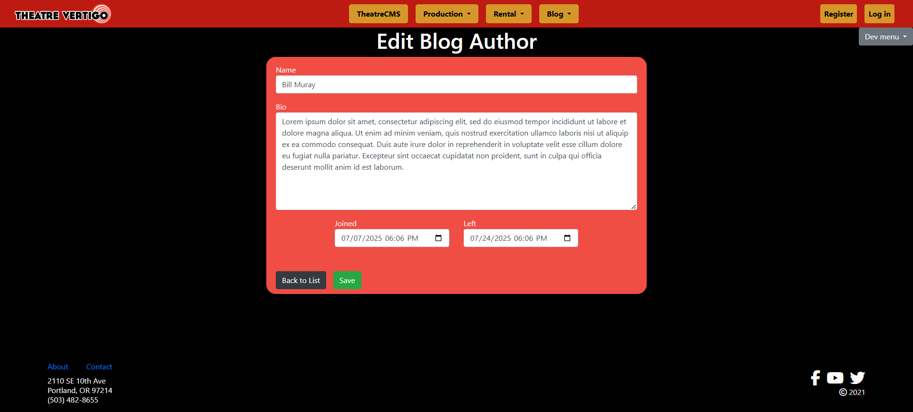
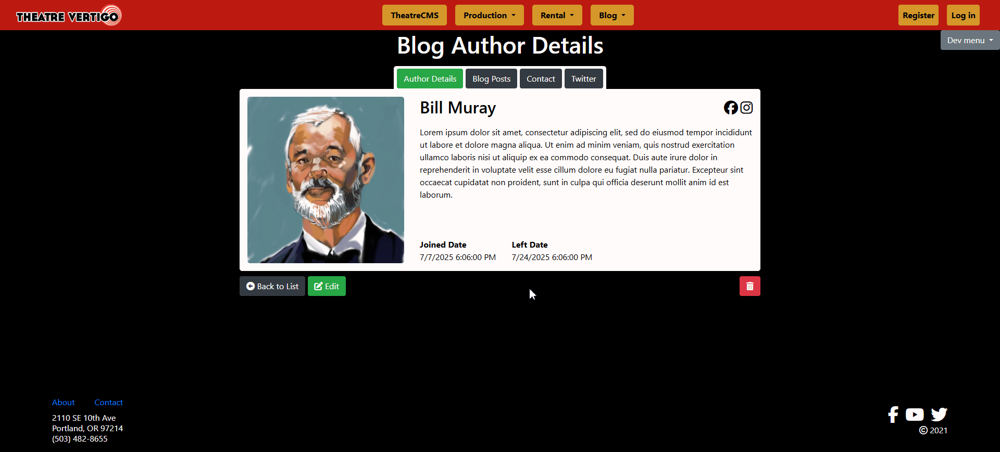
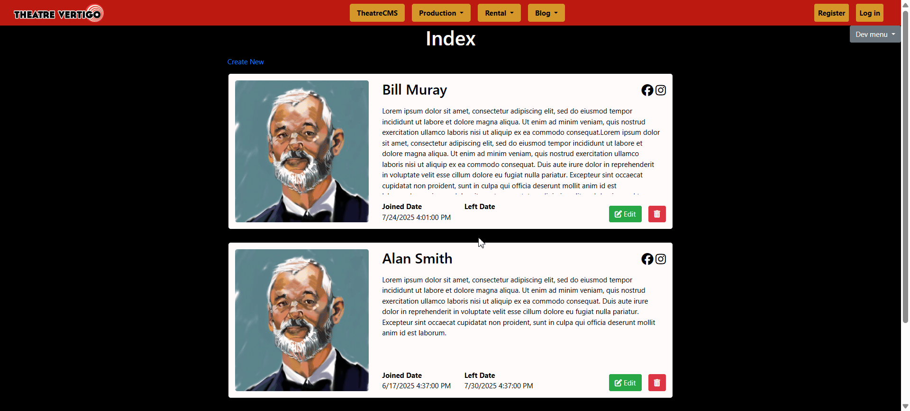
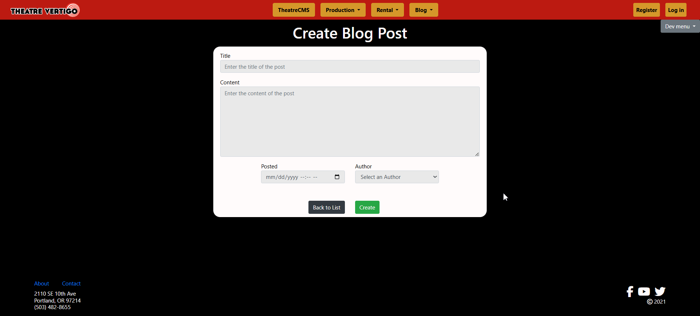
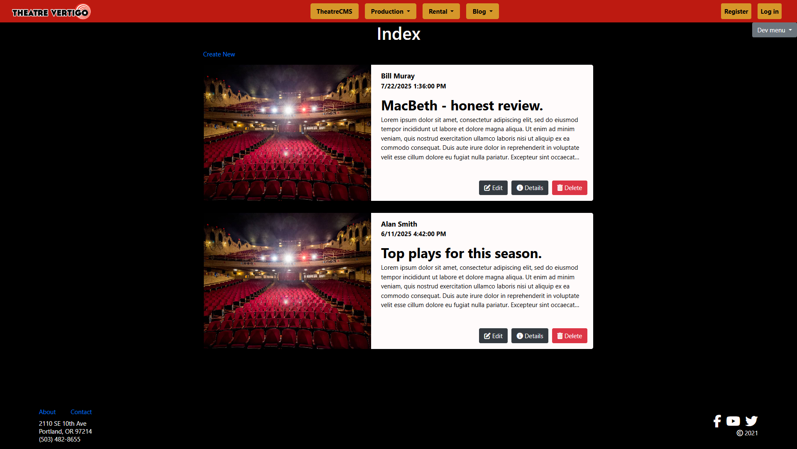
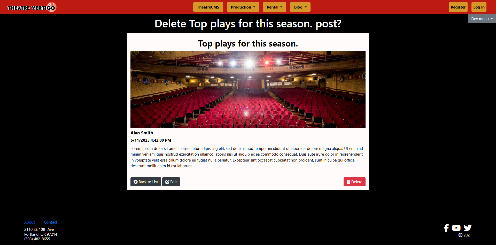
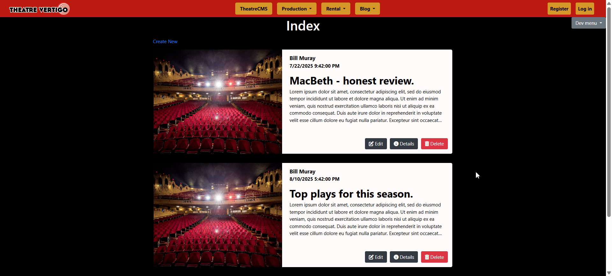
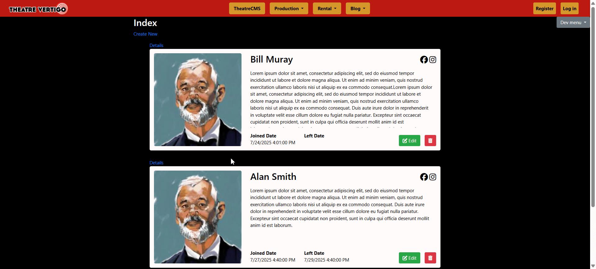

# C# Live Project

## Introduction

**Role**: Full-Stack Developer

During my time at the Technical Academy, I participated in a two-week C# Live Project, where I worked as part of a development team on a real-world web application called TheatreCMS3. This application is a comprehensive content management system for a theater website, including features for managing rentals, events, performances, and user interactions.

My main responsibility was to work on the blog section of the site. I created and updated models and views for BlogAuthors, BlogPosts, and HeadAuthors. I also implemented asynchronous deletion of items and added access restrictions to ensure that only authorized users could create, edit, or delete content. Since a large part of the application was created, I learned how to follow the project’s established coding standards, extend existing functionality, analyze unfamiliar code, and make changes without breaking other features. Working in an Agile environment, I followed the Scrum methodology, which included sprint planning, daily stand-up meetings, user stories, code reviews, and retrospectives.

This experience helped me expand my C# knowledge and improve my practical skills with the .NET Framework, Entity Framework, and Azure DevOps, giving me more confidence in working with shared codebases and contributing to team projects in a structured, professional environment.

## Core Technologies

-   **Backend:** C#, ASP.NET MVC, Entity Framework
-   **Frontend:** HTML, CSS, Javascript, Bootstrap, Razor Views
-   **Database:** SQL Server, Entity Framework ORM
-   **Version Control & Project Management:** Git, Azure DevOps

## User Stories

1. [BlogAuthor Create Model & CRUD Pages](#blogauthor-create-model--crud-pages)
2. [BlogAuthor Part 1: Create & Edit Pages](#blogauthor-part-1-create--edit-pages)
3. [BlogAuthor Part 2: Details & Delete Pages](#blogauthor-part-2-details--delete-pages)
4. [BlogAuthor Part 3: Index Page](#blogauthor-part-3-index-page)
5. [BlogAuthor Part 4: Async Delete From Index](#blogauthor-part-4-async-delete-from-index)
6. [BlogPost Create Model & CRUD Pages](#blogpost-create-model--crud-pages)
7. [Link BlogAuthor & BlogPost Models](#link-blogauthor--blogpost-models)
8. [BlogPost Part 1: Create and Edit Pages](#blogpost-part-1-create-and-edit-pages)
9. [BlogPost Part 2: Index Page](#blogpost-part-2-index-page)
10. [BlogPost Part 3: Details & Delete Pages](#blogpost-part-3-details--delete-pages)
11. [BlogPost Part 4: Index - Delete Modal](#blogpost-part-4-index---delete-modal)
12. [HeadAuthor Part 1: Create User](#headauthor-part-1-create-user)
13. [HeadAuthor Part 2: Seed HeadAuthor](#headauthor-part-2-seed-headauthor)
14. [HeadAuthor Part 3: Restrict CRUD Operations](#headauthor-part-3-restrict-crud-operations)

## BlogAuthor Create Model & CRUD Pages

The first task I worked on in the project was creating the BlogAuthor model and setting up the corresponding CRUD pages, so users could create, view, edit, and delete blog authors.

I built the model based on a provided schema and integrated it into the existing codebase under the Areas > Blog folder. To add a table corresponding to my model to the database, I registered the model in the existing ApplicationDbContext class inside the IdentityModels.cs file. Then I ran the Add-Migration and Update-Database commands to update the database. After that, I checked to make sure the new BlogAuthor table was created successfully.

```csharp
namespace TheatreCMS3.Areas.Blog.Models
{
    public class BlogAuthor
    {
        public int BlogAuthorId { get; set; }
        [Required]
        public string Name { get; set; }
        [Required]
        public string Bio { get; set; }
        [Required]
        public DateTime Joined { get; set; }
        public DateTime? Left { get; set; }
    }
}
```

Next, I used Visual Studio and EntityFramework tools to generate the controller and views for the standard CRUD operations. I made sure the generated pages used the shared \_Layout.cshtml file to match the app’s overall design. Once everything was set up, I tested each route to confirm that blog author information could be added, viewed, edited, and deleted correctly in the application.

## BlogAuthor Part 1: Create & Edit Pages

After creating the CRUD pages, I worked on improving the layout and functionality of the Create and Edit forms to match the user interface shown in the provided design sample.

In the Create.cshtml file, I set up the “Name” field as a text input, the “Bio” as a textarea, and the “Joined” and “Left” fields as datetime-local type, so users could select both date and time in one field. I then styled the form to match the site's color palette, set a max width of 800px, and centered it on the page. Inside the form, I set the fields margins according to the sample layout, adjusted the textarea size, placed the “Joined” and “Left” fields in the same row and centered them, and moved the “Back to List” button inside the form next to the main action button to improve the visual balance and user experience.

I followed the same steps for the Edit form. While working on it, I noticed that the “Joined” and “Left” fields were not showing the existing dates saved when the blog author was created. I found that this happened because C# and HTML store date formats differently. To fix this, I added logic in the Edit.cshtml file to display the dates received from a BlogAuthor class instance in the correct format for the datetime-local type.

```html
@model TheatreCMS3.Areas.Blog.Models.BlogAuthor @{ ViewBag.Title = "Edit"; Layout =
"~/Views/Shared/_Layout.cshtml"; }

<h2>Edit Blog Author</h2>

@using (Html.BeginForm()) { @Html.AntiForgeryToken()

<div class="form-horizontal blog_author-edit--create_form">
    @Html.ValidationSummary(true, "", new { @class = "text-danger" }) @Html.HiddenFor(model =>
    model.BlogAuthorId)

    <div class="form-group blog_author-edit--field_container">
        @Html.LabelFor(model => model.Name, htmlAttributes: new { @class = "control-label col-md-2"
        })
        <div class="col-md-12">
            @Html.EditorFor(model => model.Name, new { htmlAttributes = new { @class =
            "form-control" } }) @Html.ValidationMessageFor(model => model.Name, "", new { @class =
            "text-danger" })
        </div>
    </div>

    <div class="form-group blog_author-edit--field_container">
        @Html.LabelFor(model => model.Bio, htmlAttributes: new { @class = "control-label col-md-2"
        })
        <div class="col-md-12">
            @*Creates a field with textarea tag*@ @Html.TextAreaFor(model => model.Bio, new { @class
            = "form-control", rows = 8 }) @Html.ValidationMessageFor(model => model.Bio, "", new {
            @class = "text-danger" })
        </div>
    </div>

    <div class="blog_author-edit--datatime_container">
        <div class="form-group blog_author-edit--field_container">
            @Html.LabelFor(model => model.Joined, htmlAttributes: new { @class = "control-label
            col-md-2" })
            <div class="col-md-12">
                @*Creates an input field with datetime type and convert C# DataTime format to HTML
                DataTime format*@ @Html.TextBox("Joined", Model.Joined.ToString("yyyy-MM-ddTHH:mm"),
                new { @class = "form-control", type = "datetime-local" })
                @Html.ValidationMessageFor(model => model.Joined, "", new { @class = "text-danger"
                })
            </div>
        </div>

        <div class="form-group blog_author-edit--field_container">
            @Html.LabelFor(model => model.Left, htmlAttributes: new { @class = "control-label
            col-md-2" })
            <div class="col-md-12">
                @*Creates an input field with datetime type and convert C# DataTime format to HTML
                DataTime format*@ @Html.TextBox("Left", Model.Left?.ToString("yyyy-MM-ddTHH:mm") ??
                "", new { @class = "form-control", type = "datetime-local" })
                @Html.ValidationMessageFor(model => model.Left, "", new { @class = "text-danger" })
            </div>
        </div>
    </div>

    <div class="form-group blog_author-edit--buttons_container">
        <div>@Html.ActionLink("Back to List", "Index", null, new { @class = "btn btn-dark" })</div>
        <div class="col-md-offset-2 col-md-10">
            <input type="submit" value="Save" class="btn btn-success" />
        </div>
    </div>
</div>
} @section Scripts { @Scripts.Render("~/bundles/jqueryval") }
```



---

_Jump To: [Introduction](#introduction), [BlogAuthor Create Model & CRUD Pages](#blogauthor-create-model--crud-pages), [BlogAuthor Part 2: Details & Delete Pages](#blogauthor-part-2-details--delete-pages), [BlogAuthor Part 4: Async Delete From Index](#blogauthor-part-4-async-delete-from-index), [Link BlogAuthor & BlogPost Models](#link-blogauthor--blogpost-models), [BlogPost Part 2: Index Page](#blogpost-part-2-index-page), [BlogPost Part 4: Index - Delete Modal](#blogpost-part-4-index---delete-modal), [HeadAuthor Part 2: Seed HeadAuthor](#headauthor-part-2-seed-headauthor)_

---

## BlogAuthor Part 2: Details & Delete Pages

For this user story, I added custom styling to the Details and Delete views.

On the Details page, I created and styled a content card to display the selected author information, such as author's image, full name, bio, social media links, and joined/left dates. Above the card, I added buttons labeled Author Details, Latest Posts, Contact, and Twitter. I implemented functionality so that clicking each button shows the related content and hides the previous one. I also added a toggle effect that changes the active button’s color to green. To finish the page, I used Bootstrap and Font Awesome icons to style the Back to List, Edit, and Delete buttons to make their purpose clearer and easier to recognize visually.

```html
@model TheatreCMS3.Areas.Blog.Models.BlogAuthor

@{
    ViewBag.Title = "Details";
    Layout = "~/Views/Shared/_Layout.cshtml";
}

<h2>Details</h2>

<div class="blog_author-details--container">
    <div class="blog_author-details--top_buttons">
        <button type="button" class="btn btn-success" data-target="autor-details">Author Details</button>
        <button type="button" class="btn btn-dark" data-target="blog-post">Blog Posts</button>
        <button type="button" class="btn btn-dark" data-target="contact">Contact</button>
        <button type="button" class="btn btn-dark" data-target="twitter">Twitter</button>
    </div>
    <div class="blog_author-details--content">
        <div class="blog_author-details--content_photo">
            
        </div>

        <div id="autor-details" class="blog_author-details--content_container">
            <div>
                <div>
                    <h2>@Model.Name</h2>
                </div>
                <div class="blog_author-details--icons">
                    <a href="https://www.facebook.com/"><i class="fa-brands fa-facebook"></i></a>
                    <a href="https://www.instagram.com/"><i class="fa-brands fa-instagram"></i></a>
                </div>
            </div>
            <div class="blog_author-details--bio_container">
                <p>@Model.Bio</p>
            </div>
            <div class="blog_author-details--datetime_container">
                <div>
                    <p>Joined Date</p>
                    <p>@Model.Joined</p>
                </div>
                <div>
                    <p>Left Date</p>
                    <p>@Model.Left</p>
                </div>
            </div>
        </div>

        <div id="blog-post" class="blog_author-details--content_container d-none">
            <p>(Implement in future stories)</p>
        </div>
        <div id="contact" class="blog_author-details--content_container d-none">
            <p>(Implement in future stories)</p>
        </div>
        <div id="twitter" class="blog_author-details--content_container d-none">
            <p>(Implement in future stories)</p>
        </div>
    </div>
    <div class="blog_author-details--bottom_buttons">
        <div>
            <button onclick="location.href='@Url.Action("Index")'" class="btn btn-dark">
                <i class="fa-solid fa-circle-left"></i>
                Back to List
            </button>
            <button onclick="location.href='@Url.Action("Edit", "BlogAuthors", new { id = Model.BlogAuthorId })'" class="btn btn-success">
                <i class="fa-solid fa-pen-to-square"></i>
                Edit
            </button>

        </div>
        <div>
            <button onclick="location.href='@Url.Action("Delete", "BlogAuthors", new { id = Model.BlogAuthorId })'" class="btn btn-danger">
                <i class="fa-solid fa-trash-can"></i>
            </button>
        </div>
    </div>
</div>
```

```javascript
document.addEventListener("DOMContentLoaded", function () {
    const buttonsContainer = document.querySelectorAll(".blog_author-details--top_buttons")[0];
    const buttons = buttonsContainer.querySelectorAll("button");
    const contentContainers = document.querySelectorAll(".blog_author-details--content_container");

    buttons.forEach((button) => {
        button.addEventListener("click", function () {
            //This block of code change color to green for active button
            buttons.forEach((btn) => {
                btn.classList.remove("btn-success");
                btn.classList.add("btn-dark");
            });
            this.classList.remove("btn-dark");
            this.classList.add("btn-success");

            //This block of code make visible a container that corresponding to the active button
            contentContainers.forEach((container) => {
                if (!container.classList.contains("d-none")) {
                    container.classList.add("d-none");
                }

                const targetId = this.getAttribute("data-target");
                document.getElementById(targetId).classList.remove("d-none");
            });
        });
    });
});
```

On the Delete page, I replaced the default layout with a custom card that follows the same design and structure as the one on the Details page. I also styled the action buttons for a more polished look.



## BlogAuthor Part 3: Index Page

The next step in working on the BlogAuthor section was redesigning the Index view to display all blog author entries in a clean, card-style layout.

I created a partial view called \_BlogAuthor.cshtml, which included the HTML and Razor code to render each blog author as a card. Then, in the Index.cshtml file, I added logic to loop through all the blog authors from the database and display each one using the partial view.

Inside the partial view, I built a content card to show the author’s information and styled it to match the look of the Details page. I also added Edit and Delete buttons, styled using Bootstrap and Font Awesome icons. To make sure all cards stayed the same height regardless of how long the biography text was, I added a scroll effect to the bio section and hid the scrollbar for a cleaner appearance.

```html
@using TheatreCMS3.Models

<div id="blog_author-partial_view--blog_author_@Model.BlogAuthorId" class="blog_author-partial_view--container">
    <div class="blog_author-partial_view--top_section">
        <div class="blog_author-partial_view--content_photo">
            
        </div>

        <div class="blog_author-partial_view--middle_section">
            <div>
                <div>
                    <h2>
                        <a class="blog_author-partial_view--details_link" href="@Url.Action("Details", "BlogAuthors", new { id = Model.BlogAuthorId })">
                            @Model.Name
                        </a>
                    </h2>
                </div>
                <div class="blog_author-partial_view--icons">
                    <a href="https://www.facebook.com/"><i class="fa-brands fa-facebook"></i></a>
                    <a href="https://www.instagram.com/"><i class="fa-brands fa-instagram"></i></a>
                </div>
            </div>
            <div class="blog_author-partial_view--bio_container">
                <p>@Model.Bio</p>
            </div>
            <div class="blog_author-partial_view--bottom_section">
                <div class="blog_author-partial_view--datetime_container">
                    <div>
                        <p>Joined Date</p>
                        <p>@Model.Joined</p>
                    </div>
                    <div>
                        <p>Left Date</p>
                        <p>@Model.Left</p>
                    </div>
                </div>
                <div class="blog_author-partial_view--buttons">
                    <button onclick="location.href='@Url.Action("Edit", "BlogAuthors", new { id = Model.BlogAuthorId })'" class="btn btn-success">
                        <i class="fa-solid fa-pen-to-square"></i>
                        <span class="d-none d-lg-inline">Edit</span>
                    </button>
                    <button onclick="showConfirmationModal.call(this)" class="btn btn-danger"
                            data-id="@Model.BlogAuthorId"
                            data-name="@Model.Name"
                            data-url="@Url.Action("DeleteAuthor", "BlogAuthors", new { id = Model.BlogAuthorId })">
                        <i class="fa-solid fa-trash-can"></i>
                    </button>
                </div>
            </div>
        </div>
    </div>
</div>
```


## BlogAuthor Part 4: Async Delete From Index

To make the BlogAuthor index view more user-friendly, I was assigned to implement a confirmation modal that asks the user if they really want to delete a blog author, along with functionality to remove that author dynamically.

I used Bootstrap to create the confirmation modal and styled it to match the overall design of the site. Then, I updated the Delete button in the \_BlogAuthor partial view so that clicking it on any content card would trigger a JavaScript function to display the confirmation modal.

```html
<div id="blog_author_index--modal" class="modal " tabindex="-1" role="dialog">
    <div class="modal-dialog" role="document">
        <div class="modal-content">
            <div id="blog_author_index--modal_header" class="modal-header">
                <h4 id="blog_author_index--modal_title" class="modal-title"></h4>
            </div>
            <div id="blog_author_index--modal_body" class="modal-body">
                <p>Are you sure you want to delete this author from the list?</p>
            </div>
            <div class="modal-footer">
                <button
                    onclick="hideConfirmationModal()"
                    type="button"
                    class="btn btn-dark"
                    data-dismiss="modal"
                >
                    Cancel
                </button>
                <button
                    id="blog_author_index--delete_btn"
                    onclick="deleteBlogAuthor.call(this)"
                    class="btn btn-danger"
                >
                    Delete
                </button>
            </div>
        </div>
    </div>
</div>
```

Inside the modal, I added functionality so that the Cancel button, when clicked, triggers a JavaScript function that hides the modal, and the Delete button triggers a function that sends a POST request using the fetch API. This request includes the author’s ID and is handled by the DeleteAuthor controller. On the backend, the controller looks for the author by ID and, if found, removes them from the database, then returns a JSON response indicating whether the deletion was successful. Next this function reads this JSON response and, if the success parameter is true, locates the corresponding author card in the DOM and removes it with a smooth shrink animation for better visual effect.

```csharp
[HttpPost]
public JsonResult DeleteAuthor(int id)
{
    BlogAuthor blogAuthor = db.BlogAuthors.Find(id);
    Debug.WriteLine(blogAuthor);

    if (blogAuthor != null)
    {
        db.BlogAuthors.Remove(blogAuthor);
        db.SaveChanges();
        return Json(new { success = true, message = "Author deleted." });
    }
    else
    {
        return Json(new { success = false, message = "Author not found." });
    }
}
```

```javascript
function showConfirmationModal() {
    const authorId = this.getAttribute("data-id");
    const authorFullName = this.getAttribute("data-name");
    const url = this.getAttribute("data-url");
    const deleteButton = document.getElementById("blog_author_index--delete_btn");

    document.getElementById("blog_author_index--modal").style.display = "block";
    document.getElementById(
        "blog_author_index--modal_title"
    ).textContent = `Delete ${authorFullName}`;
    deleteButton.setAttribute("data-id", authorId);
    deleteButton.setAttribute("data-url", url);
}

function hideConfirmationModal() {
    document.getElementById("blog_author_index--modal").style.display = "none";
}

function deleteBlogAuthor() {
    const authorId = this.getAttribute("data-id");
    const url = this.getAttribute("data-url");
    const cardToDelete = document.getElementById(
        `blog_author-partial_view--blog_author_${authorId}`
    );

    //Send an asynchronous POST request to the provided URL to initiate deletion on the server then
    //hides confirmation modal, applies a shrinking animation to the card and then remove it from the DOM.
    fetch(url, {
        method: "POST",
    })
        .then((response) => {
            if (!response.ok) throw new Error("Network error");
            return response.json();
        })
        .then((data) => {
            if (data.success) {
                if (cardToDelete) {
                    document.getElementById("blog_author_index--modal").style.display = "none";
                    cardToDelete.classList.add("blog_author-partial_view--shrink_out");
                    setTimeout(() => {
                        cardToDelete.remove();
                    }, 2000);
                }
            } else {
                console.log(data);
                alert("Error: " + data.error);
            }
        })
        .catch((err) => {
            console.error("Fetch failed:", err);
        });
}
```



_Jump To: [Introduction](#introduction), [BlogAuthor Create Model & CRUD Pages](#blogauthor-create-model--crud-pages), [BlogAuthor Part 2: Details & Delete Pages](#blogauthor-part-2-details--delete-pages), [BlogAuthor Part 4: Async Delete From Index](#blogauthor-part-4-async-delete-from-index), [Link BlogAuthor & BlogPost Models](#link-blogauthor--blogpost-models), [BlogPost Part 2: Index Page](#blogpost-part-2-index-page), [BlogPost Part 4: Index - Delete Modal](#blogpost-part-4-index---delete-modal), [HeadAuthor Part 2: Seed HeadAuthor](#headauthor-part-2-seed-headauthor)_

## BlogPost Create Model & CRUD Pages

Continuing to expand the functionality of the Blog area, I started working on the BlogPost section.

First, I created the BlogPost model based on the provided schema. I then registered this model in the ApplicationDbContext class inside the IdentityModels.cs file and ran the Add-Migration and Update-Database commands to generate the corresponding table and update the database. Using SQL Server Object Explorer, I confirmed that the table was created correctly.

Next, I used Visual Studio’s scaffolding tools along with Entity Framework to generate a controller and a full set of CRUD views. I made sure each view used the shared \_Layout.cshtml file for consistent navigation and styling throughout the application.

Once everything was set up, I tested each view to ensure that blog posts could be created, edited, viewed, and deleted without issues.

```csharp
namespace TheatreCMS3.Areas.Blog.Models
{
    public class BlogPost
    {
        public int BlogPostId { get; set; }
        public string Title { get; set; }
        public string Content { get; set; }
        public DateTime Posted { get; set; }
        public string Author { get; set; }
    }
}
```

## Link BlogAuthor & BlogPost Models

In this part of the project, my task was to establish a relationship between the BlogAuthor and BlogPost models by adding navigation properties. The requirement was that a BlogAuthor could have many BlogPosts, but each BlogPost could be linked to only one BlogAuthor. Additionally, the navigation properties needed to be declared as virtual to support lazy loading in Entity Framework.

In the previously created BlogAuthor class, I added a virtual navigation property BlogPost with data type ICollection<> so this property can store all posts related to a specific author.

```csharp
namespace TheatreCMS3.Areas.Blog.Models
{
    public class BlogAuthor
    {
        public int BlogAuthorId { get; set; }
        [Required]
        public string Name { get; set; }
        [Required]
        public string Bio { get; set; }
        [Required]
        public DateTime Joined { get; set; }
        public DateTime? Left { get; set; }
        // Navigation properties
        public virtual ICollection<BlogPost> BlogPost { get; set; }
    }
}
```

In the BlogPost class, I added a virtual navigation property BlogAuthor with data type BlogAuthor so this property can store an author related to a specific post, and a foreign key BlogAuthorId with data type int to establish and enforce the relationship between the two tables.

```csharp
namespace TheatreCMS3.Areas.Blog.Models
{
    public class BlogPost
    {
        public int BlogPostId { get; set; }
        public string Title { get; set; }
        public string Content { get; set; }
        public DateTime Posted { get; set; }
        // Foreign key
        public int BlogAuthorId { get; set; }
        // Navigation properties
        public virtual BlogAuthor BlogAuthor { get; set; }
    }
}
```

After setting up the relationship, I ran a migration and updated the database. I then verified using SQL Server Object Explorer that the changes were applied correctly and the relationship between the tables was properly established.

## BlogPost Part 1: Create and Edit Pages

After I implemented the functionality for creating and editing posts, I moved on to improving the visual design and user interaction of the form. I started by adding a clean, centered title — “Create Blog Post” or “Edit Blog Post” — above each form, so it’s clear what the page is for. I wrapped the whole form in a responsive, centered container and added consistent margins and paddings to match the rest of the site’s design. I also added helpful placeholder text to all input fields and styled the form elements to match the site's theme.

To make the form more interactive, I added a background color change and a themed red border when an input field is focused, giving users a subtle visual cue. For the form buttons, I styled the “Create” and “Back to List” buttons with different colors, rounded corners, and hover effects. I centered them and made sure they stand out so navigation feels easier and more intuitive.

```html
@model TheatreCMS3.Areas.Blog.Models.BlogPost @{ ViewBag.Title = "Create"; Layout =
"~/Views/Shared/_Layout.cshtml"; }

<h2 class="blog_post-create--header_title">Create Blog Post</h2>

@using (Html.BeginForm()) { @Html.AntiForgeryToken()

<div class="form-horizontal blog_post-create--create_form">
    @Html.ValidationSummary(true, "", new { @class = "text-danger" })
    <div class="form-group blog_post-create--field_container">
        @Html.LabelFor(model => model.Title, htmlAttributes: new { @class = "control-label col-md-2"
        })
        <div class="col-md-12">
            @Html.EditorFor(model => model.Title, new { htmlAttributes = new { @class =
            "form-control", placeholder = "Enter the title of the post" } })
            @Html.ValidationMessageFor(model => model.Title, "", new { @class = "text-danger" })
        </div>
    </div>

    <div class="form-group blog_post-create--field_container">
        @Html.LabelFor(model => model.Content, htmlAttributes: new { @class = "control-label
        col-md-2" })
        <div class="col-md-12">
            @Html.TextAreaFor(model => model.Content, new { @class = "form-control", rows = 8,
            placeholder = "Enter the content of the post" } ) @Html.ValidationMessageFor(model =>
            model.Content, "", new { @class = "text-danger" })
        </div>
    </div>

    <div class="blog_post-create--small_fields_container">
        <div class="form-group blog_post-create--field_container">
            @Html.LabelFor(model => model.Posted, htmlAttributes: new { @class = "control-label
            col-md-2" })
            <div class="col-md-12">
                @Html.TextBoxFor(model => model.Posted, new { @class = "form-control", type =
                "datetime-local" }) @Html.ValidationMessageFor(model => model.Posted, "", new {
                @class = "text-danger" })
            </div>
        </div>

        <div class="form-group blog_post-create--field_container">
            @Html.LabelFor(model => model.BlogAuthorId, "Author", htmlAttributes: new { @class =
            "control-label col-md-2" })
            <div class="col-md-12">
                @Html.DropDownList("BlogAuthorId", null, "Select an Author", new { @class =
                "form-control" }) @Html.ValidationMessageFor(model => model.BlogAuthorId, "", new {
                @class = "text-danger" })
            </div>
        </div>
    </div>

    <div class="form-group blog_post-create--buttons_container">
        <div>@Html.ActionLink("Back to List", "Index", null, new {@class = "btn btn-dark"})</div>
        <div>
            <input type="submit" value="Create" class="btn btn-success" />
        </div>
    </div>
</div>
}
```



_Jump To: [Introduction](#introduction), [BlogAuthor Create Model & CRUD Pages](#blogauthor-create-model--crud-pages), [BlogAuthor Part 2: Details & Delete Pages](#blogauthor-part-2-details--delete-pages), [BlogAuthor Part 4: Async Delete From Index](#blogauthor-part-4-async-delete-from-index), [Link BlogAuthor & BlogPost Models](#link-blogauthor--blogpost-models), [BlogPost Part 2: Index Page](#blogpost-part-2-index-page), [BlogPost Part 4: Index - Delete Modal](#blogpost-part-4-index---delete-modal), [HeadAuthor Part 2: Seed HeadAuthor](#headauthor-part-2-seed-headauthor)_

## BlogPost Part 2: Index Page

One of the next important improvements to the BlogPost section was completely redesigning the Index page replacing the default table layout with a responsive cards that shows the post’s information and image.

I started by creating a partial view called \_BlogPost.cshtml that would contain the HTML and Razor code for a single post. Then, in Index.cshtml, I added logic to loop through all the posts from the database and render each one using that partial view.

Inside the partial view, I made a container with the blog post image on the left and the post information on the right. Since the BlogPhotos model wasn’t yet linked to BlogPost, I used a placeholder image for now. On the right side, I displayed the title, content, publication date, and author’s name, following the example design I had. I also added Edit, Details, and Delete buttons, styled to match the site theme, using Bootstrap and Font Awesome icons.

I also made sure that long post content doesn’t overflow its container or change container's max height. Instead, it now gets trimmed with an ellipsis (…) so it looks cleaner and more aesthetic.

```csharp
@using TheatreCMS3.Models

<div id="blog_post-partial_view--blog_post_@Model.BlogPostId" class="blog_post-partial_view--container">
    <div class="blog_post-partial_view--image_container">
        
    </div>
    <div class="blog_post-partial_view--content_container">
        <div class="blog_post-partial_view--post_author">
            <p>@Model.BlogAuthor.Name</p>
        </div>
        <div class="blog_post-partial_view--post_posted">
            <p>@Model.Posted</p>
        </div>
        <div class="blog_post-partial_view--post_title">
            <p>@Model.Title</p>
        </div>
        <div class="blog_post-partial_view--post_content">
            <p>@Model.Content</p>
        </div>
        <div class="blog_post-partial_view--buttons">
            <button onclick="location.href='@Url.Action("Edit", "BlogPosts", new { id = Model.BlogPostId })'" class="btn btn-dark">
                <i class="fa-solid fa-pen-to-square"></i>
                <span class="d-none d-lg-inline">Edit</span>
            </button>
            <button onclick="location.href='@Url.Action("Details", "BlogPosts", new { id = Model.BlogPostId })'" class="btn btn-dark">
                <i class="fa-solid fa-circle-info"></i>
                <span class="d-none d-lg-inline">Details</span>
            </button>
            <button onclick="showConfirmationModal.call(this)" class="btn btn-danger"
                    data-id="@Model.BlogPostId"
                    data-title="@Model.Title"
                    data-url="@Url.Action("DeletePost", "BlogPosts", new { id = Model.BlogPostId })">
                <i class="fa-solid fa-trash-can"></i>
                <span class="d-none d-lg-inline">Delete</span>
            </button>
        </div>
    </div>
</div>
```



## BlogPost Part 3: Details & Delete Pages

To finish this user story, I added custom styling to the Details and Delete views.

On the Delete page, I created a container to show all the information about the selected post. Following the provided design link, I centered the title, made the image take up the full width of the container, placed the author’s name and publication date on the left side, and displayed the post content across the full container width. At the bottom, I added Back to List and Edit buttons aligned to the left, and a Delete button aligned to the right. I styled these buttons with Bootstrap and Font Awesome icons so they match the site’s overall look.

On the Details page, I replaced the default layout with a custom card that uses the same design and structure as the Delete page.

```html
@model TheatreCMS3.Areas.Blog.Models.BlogPost

@{
    ViewBag.Title = "Delete";
    Layout = "~/Views/Shared/_Layout.cshtml";
}

<h2 class="blog_post-delete--header_title">Delete @Model.Title post?</h2>

<div class="blog_post-delete--container">
    <div class="blog_post-details--title_container">
        <p>@Model.Title</p>
    </div>
    <div class="blog_post-delete--image_container">
        
    </div>
    <div class="blog_post-delete--author_container">
        <p>@Model.BlogAuthor.Name</p>
    </div>
    <div class="blog_post-delete--posted_container">
        <p>@Model.Posted</p>
    </div>
    <div class="blog_post-delete--content_container">
        <p>@Model.Content</p>
    </div>
    <div class="blog_post-delete--buttons_container">
        <div>
            <button onclick="location.href='@Url.Action("Index")'" class="btn btn-dark">
                <i class="fa-solid fa-circle-left"></i>
                <span class="d-none d-lg-inline">Back to List</span>
            </button>
            <button onclick="location.href='@Url.Action("Edit", "BlogPosts", new { id = Model.BlogPostId })'" class="btn btn-dark">
                <i class="fa-solid fa-pen-to-square"></i>
                <span class="d-none d-lg-inline">Edit</span>
            </button>
        </div>
        @using (Html.BeginForm())
        {
            @Html.AntiForgeryToken()
            <button onclick="location.href='@Url.Action("Delete", "BlogPosts", new { id = Model.BlogPostId })'" class="btn btn-danger" type="submit">
                <i class="fa-solid fa-trash-can"></i>
                <span class="d-none d-lg-inline">Delete</span>
            </button>
        }
    </div>
</div>
```



## BlogPost Part 4: Index - Delete Modal

In this user story, my task was to change how blog posts are deleted on the Index page. Instead of sending the user to a separate delete page, I needed to show a confirmation modal. Once the deletion was confirmed, the blog post should be removed without reloading the page, and a fixed message should appear at the top of the screen saying the post was deleted successfully.

To create and style the confirmation modal, I used Bootstrap. Then, in the \_BlogPost partial view, I updated the Delete button so that clicking it runs a JavaScript function to display the modal.

Inside the modal, for the Cancel button, I reused the javascript function which hides modal, modifying it to be usable with different modals. The Delete button calls another function that sends a POST request using the fetch API and is handled by the DeletePost controller. On the backend, the controller searches for the post by its ID, and if it’s found, deletes it from the database and returns a JSON response indicating whether the deletion was successful. This function then reads this JSON response and, if the response parameter success is true, the JavaScript function finds the post element in the DOM and removes it with a smooth fade-out animation.

After I made sure the new delete function worked correctly, I implemented the popup message. I wrote a JavaScript function that creates a div container, adds text saying the post was deleted successfully, and applies a CSS class for styling. The container is then added to the Index page’s DOM, stays visible for 3 seconds, and then fades out before being removed from the DOM.

```csharp
[HttpPost]
public JsonResult DeletePost(int id)
{
    BlogPost blogPost = db.BlogPosts.Find(id);

    if (blogPost != null)
    {
        db.BlogPosts.Remove(blogPost);
        db.SaveChanges();
        return Json(new { success = true, message = "Post deleted." });
    }
    else
    {
        return Json(new { success = false, message = "Post not found." });
    }
}
```

```javascript
function showConfirmationModal() {
    const modalType = document.getElementsByClassName("modal-type")[0].getAttribute("data-type");
    switch (modalType) {
        case "author":
            const authorId = this.getAttribute("data-id");
            const authorFullName = this.getAttribute("data-name");
            const authorUrl = this.getAttribute("data-url");
            const deleteButton = document.getElementById("blog_author_index--delete_btn");

            document.getElementById("blog_author_index--modal").style.display = "block";
            document.getElementById(
                "blog_author_index--modal_title"
            ).textContent = `Delete ${authorFullName}`;
            deleteButton.setAttribute("data-id", authorId);
            deleteButton.setAttribute("data-url", authorUrl);
            break;

        case "post":
            const postId = this.getAttribute("data-id");
            const title = this.getAttribute("data-title");
            const postUrl = this.getAttribute("data-url");
            const delButton = document.getElementById("blog_post_index--delete_btn");

            document.getElementById("blog_post_index--modal").style.display = "block";
            document.getElementById("blog_post_index--modal_title").textContent = `Delete ${title}`;
            delButton.setAttribute("data-id", postId);
            delButton.setAttribute("data-url", postUrl);
            break;
    }
}

function hideConfirmationModal() {
    const modalType = document.getElementsByClassName("modal-type")[0].getAttribute("data-type");
    switch (modalType) {
        case "author":
            document.getElementById("blog_author_index--modal").style.display = "none";
            break;
        case "post":
            document.getElementById("blog_post_index--modal").style.display = "none";
            break;
    }
}

function deleteBlogPost() {
    const postId = this.getAttribute("data-id");
    const url = this.getAttribute("data-url");
    const postToDelete = document.getElementById(`blog_post-partial_view--blog_post_${postId}`);

    //Send an asynchronous POST request to the provided URL to initiate deletion on the server then
    //hides confirmation modal, applies a fading animation to the card and then remove it from the DOM.
    fetch(url, {
        method: "POST",
    })
        .then((response) => {
            if (!response.ok) throw new Error("Network error");
            return response.json();
        })
        .then((data) => {
            if (data.success) {
                if (postToDelete) {
                    document.getElementById("blog_post_index--modal").style.display = "none";
                    postToDelete.classList.add("blog_post-partial_view--fade_out");
                    setTimeout(() => {
                        postToDelete.remove();
                    }, 1500);
                    setTimeout(() => {
                        showPopupMessage();
                    }, 2000);
                }
            } else {
                console.log(data);
                alert("Error: " + data.error);
            }
        })
        .catch((err) => {
            console.error("Fetch failed:", err);
        });
}

// This block of code creates a div element with the message about successful deletion
// and display it for 3 seconds
function showPopupMessage() {
    const popupMessage = document.createElement("div");
    popupMessage.innerHTML =
        'The blog post was deleted successfully <i class="fa-solid fa-check"></i>';
    const parentElement = document.getElementsByClassName("body-content")[0];
    parentElement.appendChild(popupMessage);
    popupMessage.classList.add("blog_post_index--popup_message");

    setTimeout(() => {
        popupMessage.classList.add("blog_post-partial_view--fade_out");
    }, 3000);

    // Listen for the end of the CSS transition (fade-out)
    popupMessage.addEventListener("animationend", () => {
        popupMessage.remove();
    });
}
```



_Jump To: [Introduction](#introduction), [BlogAuthor Create Model & CRUD Pages](#blogauthor-create-model--crud-pages), [BlogAuthor Part 2: Details & Delete Pages](#blogauthor-part-2-details--delete-pages), [BlogAuthor Part 4: Async Delete From Index](#blogauthor-part-4-async-delete-from-index), [Link BlogAuthor & BlogPost Models](#link-blogauthor--blogpost-models), [BlogPost Part 2: Index Page](#blogpost-part-2-index-page), [BlogPost Part 4: Index - Delete Modal](#blogpost-part-4-index---delete-modal), [HeadAuthor Part 2: Seed HeadAuthor](#headauthor-part-2-seed-headauthor)_

## HeadAuthor Part 1: Create User

After finishing work on the BlogPost section, my next task was to create a head author for the blog area. This role acts like an admin for the BlogAuthor section and is responsible for managing other authors and hiring new ones.

The first step was to create a HeadAuthor model that extends the ApplicationUser class and add properties based on the provided schema. Unlike the previous models, this time I didn’t add the HeadAuthor class to the ApplicationDbContext because we needed a Table Per Hierarchy (TPH) structure with this class.

To actually add the HeadAuthor properties to the existing main table, I ran the Add-Migration and Update-Database commands, and after checked the AspNetUsers table to make sure new columns matching the HeadAuthor properties appeared.

```csharp
namespace TheatreCMS3.Areas.Blog.Models
{
    public class HeadAuthor : ApplicationUser
    {
        public int ViewsPerMonth { get; set; }
        public int AuthorsHired { get; set; }
        public int AuthorsLetGo { get; set; }
    }
}
```

## HeadAuthor Part 2: Seed HeadAuthor

My next task was to write a seed method for the HeadAuthor so it could create an instance of this class and save it to the database before the page loads. This was needed so I could have a HeadAuthor available for testing.

I created a static method called SeedHeadAuthor inside the HeadAuthor class. It takes UserManager\<HeadAuthor\> userManager and RoleManager\<IdentityRole\> roleManager as parameters, creates one instance of HeadAuthor, and assigns it the "head author" role. Then, in the Configuration.cs file inside the Migrations folder, I updated the Seed method so it calls my SeedHeadAuthor method.

Finally, I ran the application to check if the Seed method worked and if one HeadAuthor record was created in the database.

```csharp
namespace TheatreCMS3.Areas.Blog.Models
{
    public class HeadAuthor : ApplicationUser
    {
        public int ViewsPerMonth { get; set; }
        public int AuthorsHired { get; set; }
        public int AuthorsLetGo { get; set; }

        // Static method to seed the database with one HeadAuthor user
        public static void SeedHeadAuthor(UserManager<HeadAuthor> userManager, RoleManager<IdentityRole> roleManager)
        {
            // Creates a role if it does not exist
            if (!roleManager.RoleExists("HeadAuthor"))
            {
                IdentityRole role = new IdentityRole("HeadAuthor");
                roleManager.Create(role);
            }

            // Creates a head author if it does not exist
            string email = "headauthor@yahoo.com";
            string password = "Password!123";
            HeadAuthor headAuthor = userManager.FindByEmail(email);

            if (headAuthor == null)
            {
                headAuthor = new HeadAuthor()
                {
                    UserName = "TheHeadAuthor",
                    Email = email,
                    ViewsPerMonth = 1077,
                    AuthorsHired = 3,
                    AuthorsLetGo = 1
                };

                var result = userManager.Create(headAuthor, password);

                if (result.Succeeded)
                {
                    userManager.AddToRole(headAuthor.Id, "HeadAuthor");
                }
            }
        }
    }
}
```

```csharp

namespace TheatreCMS3.Migrations
{
    using System.Data.Entity.Migrations;
    using Microsoft.AspNet.Identity;
    using Microsoft.AspNet.Identity.EntityFramework;
    using TheatreCMS3.Areas.Blog.Models;
    using TheatreCMS3.Models;

    internal sealed class Configuration : DbMigrationsConfiguration<TheatreCMS3.Models.ApplicationDbContext>
    {
        public Configuration()
        {
            AutomaticMigrationsEnabled = true;
            AutomaticMigrationDataLossAllowed = true;
        }

        protected override void Seed(ApplicationDbContext context)
        {
            var userManager = new UserManager<HeadAuthor>(new UserStore<HeadAuthor>(context));
            var roleManager = new RoleManager<IdentityRole>(new RoleStore<IdentityRole>(context));

            HeadAuthor.SeedHeadAuthor(userManager, roleManager);
        }
    }
}
```

## HeadAuthor Part 3: Restrict CRUD Operations

In this user story, my task was to restrict CRUD operations so that only a HeadAuthor could perform them. Any other user trying to access these features should be redirected to an AccessDenied page.

To implement this, I first created a new view called AccessDenied inside the BlogAuthor views folder. Then I built a custom class called HeadAuthorAuthorizeAttribute, which extends the built-in AuthorizeAttribute class. This custom class checks if a user has the HeadAuthor role.

```csharp
namespace TheatreCMS3.Areas.Blog.Authorization_Filter_Logic
{
    public class HeadAuthorAuthorizeAttribute : AuthorizeAttribute
    {
        public HeadAuthorAuthorizeAttribute()
        {
            // Only users with this roles can be authorized
            Roles = "HeadAuthor";
        }

        protected override void HandleUnauthorizedRequest(AuthorizationContext filterContext)
        {
            // Redirect to AccessDenied page users that are not authenticated or
            // authenticated but do not in role
            filterContext.Result = new RedirectResult("~/Blog/BlogAuthors/AccessDenied");
        }
    }
}
```

Finally, I updated the restricted pages so that if a non-HeadAuthor user tries to open them, they are automatically redirected to the AccessDenied page. This ensures better security and proper role-based access control within the application.

```csharp
 [HeadAuthorAuthorize] // Checks if a user has the HeadAuthor role
 public ActionResult Edit(int? id)
 {
     if (id == null)
     {
         return new HttpStatusCodeResult(HttpStatusCode.BadRequest);
     }
     BlogAuthor blogAuthor = db.BlogAuthors.Find(id);
     if (blogAuthor == null)
     {
         return HttpNotFound();
     }
     return View(blogAuthor);
 }
```



## Conclusion

Taking part in the C# Live Project was a really valuable learning experience that helped me put my knowledge into practice in a real-world setting. I improved my understanding of C# and the .NET framework by working on practical tasks and solving real coding problems, and I also became more confident using tools like Entity Framework, SQL Server, and the MVC architecture in a project environment.

Working in a team taught me how important it is to follow the project’s architecture, use consistent coding patterns and naming conventions, and keep everything organized with version control tools like Git.

Overall, this project not only improved my technical skills but also showed me how to work effectively as part of a professional development team.

## Key Learnings

-   **C# and .Net:** Furthered my knowledge of C# and .Net, how they work together, and how they differ from other languages and platforms.

-   **Entity Framework Proficiency:** Deepened my understanding of model creation, relationships, migrations, and data context management.

-   **AJAX and Partial Views:** Implemented dynamic sorting using Ajax, improving responsiveness without full page reloads.

-   **Frontend Styling & UX:** Styled Razor views with Bootstrap and enhance interactivity using JavaScript.

-   **Agile Practices:** Participated in daily stand-ups, sprint planning, and retrospectives, strengthening my project management and communication skills.

-   **Time Management:** Balanced multiple tasks within sprint deadlines, prioritizing features and fixing bugs efficiently.

-   **Debugging & Problem Solving:** Throughout the project, I developed ability to troubleshoot errors, read error messages carefully, and find creative solutions when things didn’t work as expected.

-   **Version Control & DevOps Tools:** I became more confident using Git to track changes and manage code collaboratively. I also gained hands-on experience with Azure DevOps for organizing tasks, managing sprints, and collaborating with teammates in a structured development workflow.

-   **Research & Self-Learning:** When I faced unfamiliar tasks or bugs, I actively researched documentation and online resources to find solutions, improving my ability to learn independently and quickly.

_Jump To: [Introduction](#introduction), [BlogAuthor Create Model & CRUD Pages](#blogauthor-create-model--crud-pages), [BlogAuthor Part 2: Details & Delete Pages](#blogauthor-part-2-details--delete-pages), [BlogAuthor Part 4: Async Delete From Index](#blogauthor-part-4-async-delete-from-index), [Link BlogAuthor & BlogPost Models](#link-blogauthor--blogpost-models), [BlogPost Part 2: Index Page](#blogpost-part-2-index-page), [BlogPost Part 4: Index - Delete Modal](#blogpost-part-4-index---delete-modal), [HeadAuthor Part 2: Seed HeadAuthor](#headauthor-part-2-seed-headauthor)_
